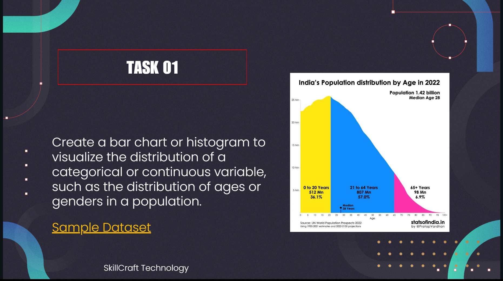

# SkillCraft_DS_01

#  SkillCraft Technology - Data Science Internship (Task 1)

Hi there!   
I'm ** VASUDEVAN **, and this repository showcases my submission for **Task 1** of the **SkillCraft Technology Data Science Internship**. In this task, I explored a real-world dataset and used data analysis and visualization techniques to uncover some interesting patterns.

---

## 🌍 About the Dataset

I worked with the [**World Population Dataset**](https://data.worldbank.org/indicator/SP.POP.TOTL), which contains population statistics of various countries as of 2022. Some of the key features in the dataset include:

- Total population  
- Yearly population change (%)  
- Population density  
- Fertility rate  
- Median age  
- Urban population share  
- World population share  
... and more!

---

## 🧰 Tools & Libraries

This project was completed using Python in a Jupyter Notebook environment, with the help of:

- `pandas` and `numpy` for handling and cleaning data  
- `matplotlib` and `seaborn` for creating visualizations  
- Jupyter Notebook for organizing and presenting my analysis

---

## 🔍 What I Did – A Quick Walkthrough

### 1. **Getting to Know the Data**
First, I took a look at the structure of the dataset, explored the columns, and identified any missing or inconsistent values.

### 2. **Cleaning Things Up**
I handled nulls, converted data types where necessary, and made sure everything was analysis-ready.

### 3. **Let’s Visualize!**
I created a series of charts to better understand the relationships in the data:

- Bar plots for identifying the top 10 most populous countries 
- A heatmap to see how features like fertility rate, migration, and median age are related   
- Boxplots and histograms to explore outliers and distribution shapes   
- Stacked bar charts to compare urban vs total population 

---

## 💡 Key Takeaways

- **Population Concentration**: A few countries dominate the global population.
- **Fertility vs Age**: Countries with higher fertility rates tend to have lower median ages.
- **Urbanization**: Heavily urbanized nations also tend to have higher population densities.
- **Outliers**: Migration and fertility show significant variations across countries.

---

## 🎯 Conclusion

This EDA task gave me a hands-on opportunity to explore a real-world dataset and apply core data analysis skills. I enjoyed finding stories in the numbers and turning them into visual insights. It also reinforced how vital the EDA phase is before diving into any advanced modeling.

---

Thanks for stopping by and reviewing my work! 😊
